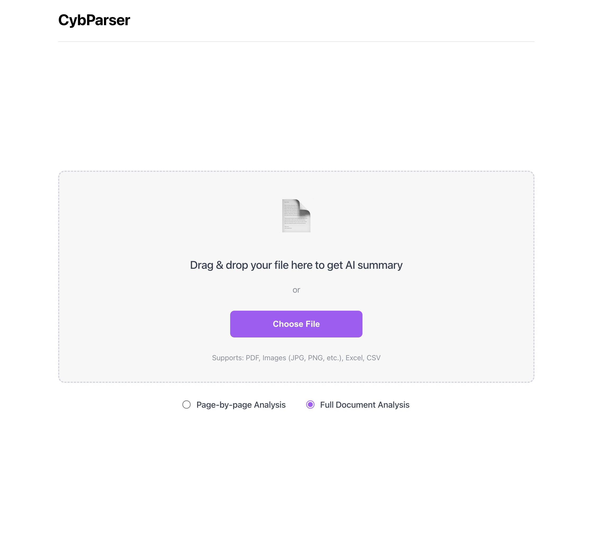
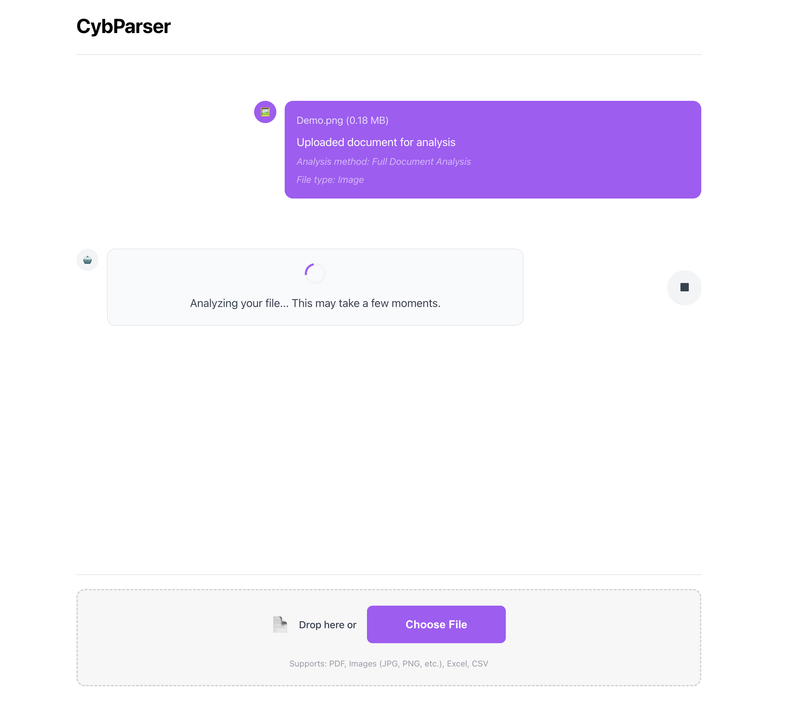

# 📄 CybParser - Multi-Format Document Analysis Tool

A powerful **multi-format document analysis tool** built with **LangChain**, **local Llama2**, **FastAPI**, and **React**. Upload PDF, image, Excel, or CSV files and get intelligent AI-powered analysis using a completely local and private AI model.


## ✨ Features

- 📄 **Multi-Format Support** - Upload and analyze multiple document types:
  - **PDF files** - Text extraction and analysis
  - **Images** - OCR text extraction (JPG, PNG, GIF, BMP, TIFF, WEBP)
  - **Excel files** - Spreadsheet data analysis (XLS, XLSX, XLSM)
  - **CSV files** - Tabular data processing
- 🧠 **AI-Powered Analysis** - Uses local Llama2 model through LangChain for intelligent document understanding
- 📊 **Multiple Analysis Types**:
  - **Page-by-Page Analysis** - Detailed analysis of individual sections/pages
  - **Full Document Analysis** - Comprehensive document summary and insights
- 🎨 **Modern React Interface** - Clean, ChatGPT-like UI with drag-and-drop support
- ⚡ **Fast Processing** - Built with FastAPI backend and Vite-powered React frontend
- 🔒 **Privacy-First** - All processing happens locally with your own Llama2 model
- 🛑 **Cancellable Operations** - Stop analysis anytime with the stop button
- 📱 **Mobile Responsive** - Works seamlessly on desktop and mobile devices

## 🚀 Quick Start

### Prerequisites

- Python 3.8+
- Node.js 16+ and npm
- Ollama (for local Llama2 model)
- Tesseract OCR (for image text extraction)

### Installation

1. **Clone the repository**
```bash
git clone <your-repo-url>
cd LangChainTool
```

2. **Install Python dependencies**
```bash
pip install -r requirements.txt
```

3. **Install Node.js dependencies**
```bash
npm install
```

4. **Install Tesseract OCR**
```bash
# macOS
brew install tesseract

# Ubuntu/Debian
sudo apt-get install tesseract-ocr

# Windows
# Download from: https://github.com/UB-Mannheim/tesseract/wiki
```

5. **Set up environment variables**
Create a `.env` file in the root directory:
```env
# Model Configuration
OLLAMA_MODEL=llama2
OLLAMA_BASE_URL=http://localhost:11434

# Server configuration (optional)
HOST=0.0.0.0
PORT=8000

# File upload settings (optional)
MAX_FILE_SIZE_MB=10
UPLOAD_DIR=uploads
```

6. **Set up Ollama and Llama2**
```bash
# Install Ollama (if not already installed)
curl -fsSL https://ollama.ai/install.sh | sh

# Pull the Llama2 model
ollama pull llama2

# Start Ollama service
ollama serve
```

7. **Start the application**

**Terminal 1 - Backend:**
```bash
python src/main.py
```

**Terminal 2 - Frontend:**
```bash
npm run dev
```

8. **Open your browser**
Go to `http://localhost:3000` to access the React interface

## 📖 Usage

### Web Interface

1. **Upload Document**: 
   - Drag and drop any supported file (PDF, Image, Excel, CSV)
   - Or click "Choose File" to browse
   - See supported formats at the bottom of upload area

2. **Choose Analysis Type**: 
   - **Page-by-Page Analysis** - Detailed section-by-section breakdown
   - **Full Document Analysis** - Comprehensive overview and insights

3. **Analyze**: Click "Upload & Analyze" and watch real-time processing

4. **View Results**: 
   - File type and metadata information
   - AI-generated analysis and insights
   - Stop analysis anytime with the stop button

5. **Upload More**: Use the bottom upload area for additional documents

### Supported File Types

| Type | Extensions | Processing Method |
|------|------------|------------------|
| **PDF** | .pdf | LangChain PyPDFLoader |
| **Images** | .jpg, .jpeg, .png, .gif, .bmp, .tiff, .webp | Tesseract OCR |
| **Excel** | .xls, .xlsx, .xlsm | Pandas + sheet analysis |
| **CSV** | .csv | Pandas tabular processing |

### API Endpoints

#### Upload and Analyze Document
```bash
POST /api/analyze-pdf/
```

**Parameters:**
- `file`: Document file (multipart/form-data)
- `analysis_type`: "detailed" or "comprehensive"

**Example using curl:**
```bash
curl -X POST "http://localhost:8000/api/analyze-pdf/" \
     -F "file=@your_document.pdf" \
     -F "analysis_type=comprehensive"
```

#### Health Check
```bash
GET /api/health
```

#### API Information
```bash
GET /api/info
```

## 🏗️ Architecture

### Backend Components

1. **Multi-Format Document Loader** (`src/document_loader.py`)
   - Handles PDF, Image, Excel, and CSV files
   - Uses appropriate libraries for each format
   - Enhances documents with rich metadata

2. **LLM Analyzer** (`src/llm_analyzer.py`)
   - Integrates with local Llama2 through LangChain
   - Robust error handling and retry logic
   - Multiple analysis strategies

3. **FastAPI Backend** (`src/main.py`)
   - Pure API server with /api prefix
   - File upload handling and validation
   - Error handling and logging

4. **Configuration** (`config/settings.py`)
   - Environment variable management
   - Multi-format file validation

### Frontend Components

1. **React Application** (`src/App.jsx`)
   - Main application logic and state management
   - File upload handling with abort controller
   - Analysis response formatting

2. **Upload Components**
   - `UploadArea.jsx` - Initial central upload interface
   - `BottomUpload.jsx` - Persistent bottom upload area

3. **Chat Interface**
   - `ConversationArea.jsx` - ChatGPT-like conversation display
   - `Message.jsx` - Individual message bubbles with file type icons
   - `LoadingSpinner.jsx` - Analysis progress indicator

### Analysis Types

- **Page-by-Page Analysis**: Analyzes each page/section individually with detailed breakdown
- **Full Document Analysis**: Comprehensive document summary with key insights and metadata

## 🔧 Configuration

All configuration is handled through environment variables:

| Variable | Description | Default |
|----------|-------------|---------|
| `OLLAMA_MODEL` | Ollama model name | `llama2` |
| `OLLAMA_BASE_URL` | Ollama service URL | `http://localhost:11434` |
| `HOST` | Server host | `0.0.0.0` |
| `PORT` | Server port | `8000` |
| `MAX_FILE_SIZE_MB` | Maximum upload size in MB | `10` |
| `UPLOAD_DIR` | Temporary upload directory | `uploads` |

## 🛠️ Development

### Project Structure

```
LangChainTool/
├── src/                          # Backend Python code
│   ├── __init__.py
│   ├── main.py                   # FastAPI application
│   ├── document_loader.py        # Multi-format document processing
│   ├── llm_analyzer.py          # LLM analysis with Llama2
│   ├── app_config.py            # FastAPI configuration
│   └── file_handlers.py         # File validation utilities
├── src/components/               # React frontend components
│   ├── App.jsx                  # Main React application
│   ├── Header.jsx               # Application header
│   ├── UploadArea.jsx           # Main upload interface
│   ├── BottomUpload.jsx         # Bottom upload area
│   ├── ConversationArea.jsx     # Chat-like conversation
│   ├── Message.jsx              # Message bubbles
│   ├── LoadingSpinner.jsx       # Loading animation
│   └── AnalysisOptions.jsx      # Analysis type selection
├── config/
│   └── settings.py              # Configuration management
├── requirements.txt             # Python dependencies
├── package.json                 # Node.js dependencies
├── vite.config.js              # Vite configuration
├── .env                        # Environment variables
└── README.md                   # Documentation
```

### Adding New Features

1. **New Document Types**: Extend `document_loader.py` with additional format handlers
2. **Analysis Types**: Add new prompt templates in `llm_analyzer.py`
3. **API Endpoints**: Add routes in `src/main.py`
4. **Frontend Features**: Create new React components in `src/components/`

### Running in Development

**Backend (with auto-reload):**
```bash
python src/main.py
# or
uvicorn src.main:app --reload --host 0.0.0.0 --port 8000
```

**Frontend (with hot reload):**
```bash
npm run dev
```

## 📊 Example Output

### Document Summary
```json
{
  "file_name": "business_report.pdf",
  "file_type": "pdf",
  "total_pages": 15,
  "total_words": 3542,
  "total_characters": 18234
}
```

### Excel Document Summary
```json
{
  "file_name": "sales_data.xlsx",
  "file_type": "excel",
  "total_pages": 3,
  "sheets": ["Q1 Sales", "Q2 Sales", "Summary"],
  "total_words": 892
}
```

### AI Analysis
```
📋 Document Information:
File Type: pdf
Pages/Sections: 15

🧠 Document Analysis:
This business report analyzes quarterly performance metrics and provides strategic recommendations for growth.

**MAIN SECTIONS & CONTENT**
- Financial Performance: Revenue increased 15% year-over-year
- Market Analysis: Competitive landscape and opportunities  
- Strategic Recommendations: Focus on digital transformation

**KEY TAKEAWAYS**
1. Strong financial performance with consistent growth
2. Market opportunities in digital channels
3. Need for technology investment
4. Customer satisfaction scores improved
5. Operational efficiency gains identified
```

## ⚠️ Limitations

- **File Size**: Limited by `MAX_FILE_SIZE_MB` setting (default: 10MB)
- **OCR Accuracy**: Image text extraction depends on image quality
- **Excel Complexity**: Very large spreadsheets are limited to 100 rows for processing
- **Model Performance**: Analysis speed depends on local hardware and Ollama setup
- **Language Support**: Optimized for English text analysis

## 🔒 Security & Privacy

- **Local Processing**: All AI analysis happens on your machine
- **No Data Sharing**: Documents never leave your environment
- **Temporary Files**: Automatically cleaned up after processing
- **File Validation**: Strict file type and size validation
- **CORS Configuration**: Configured for local development (adjust for production)

## 🚀 Performance Tips

1. **Hardware**: More RAM and CPU cores improve Llama2 performance
2. **Model Selection**: Smaller models (llama2:7b) are faster than larger ones
3. **File Optimization**: Compress images and optimize PDFs before upload
4. **Batch Processing**: Process multiple small files rather than very large ones

## 📝 License

This project is open source. Please check the license file for details.

## 🤝 Contributing

1. Fork the repository
2. Create a feature branch
3. Make your changes
4. Add tests if applicable
5. Test both backend and frontend
6. Submit a pull request

## 📞 Support

For issues, questions, or feature requests, please open an issue on the repository.

## 🛠️ Troubleshooting

### Common Issues

1. **Ollama Connection Failed**: Ensure Ollama is running with `ollama serve`
2. **OCR Not Working**: Install Tesseract OCR for your system
3. **Frontend Not Loading**: Check that both backend (8000) and frontend (3000) are running
4. **Analysis Timeout**: Try smaller files or use a faster Ollama model

### Setup Scripts

Use the provided setup script for automatic Ollama installation:
```bash
chmod +x setup_ollama.sh
./setup_ollama.sh
```

---

**Built with ❤️ using LangChain, Llama2, FastAPI, and React**
